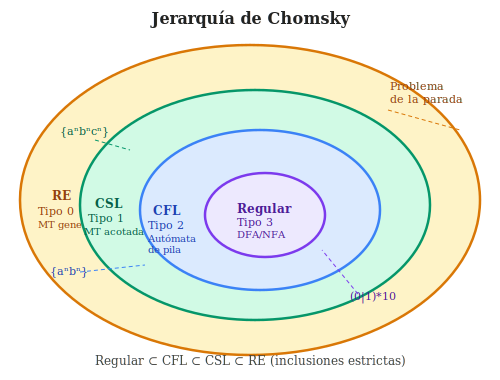

# Autómatas de Pila y Lenguajes Independientes del Contexto

> **Dificultad:** ⭐⭐⭐ Avanzado · **Tiempo de lectura:** ~25 min


## Prerrequisitos

- [Gramáticas y jerarquía de Chomsky](06-gramaticas-y-jerarquia-chomsky.md)
- [Autómatas finitos](05-automatas-finitos-y-lenguajes-regulares.md)

## Objetivos de aprendizaje

1. Definir un autómata de pila (PDA) y simular su cómputo paso a paso.
2. Demostrar la equivalencia entre PDA y gramáticas libres de contexto.
3. Usar el lema de bombeo para CFL para probar que {aⁿbⁿcⁿ} no es CFL.


## Intuición

Los autómatas finitos (DFA/NFA) solo pueden contar módulo un número fijo: no pueden
reconocer $\{a^n b^n : n \geq 1\}$ porque necesitarían recordar cuántas 'a' han visto.
Los **autómatas de pila** (PDA, *Pushdown Automata*) añaden una memoria ilimitada en
forma de pila (*stack*), lo que les permite reconocer los **lenguajes independientes
del contexto** (CFL, *Context-Free Languages*), la clase que incluye la mayoría de los
lenguajes de programación.

## Autómatas de pila (PDA)

Un **PDA** es una 7-tupla $(Q, \Sigma, \Gamma, \delta, q_0, Z_0, F)$ donde:

- $Q$: conjunto finito de estados.
- $\Sigma$: alfabeto de entrada.
- $\Gamma$: alfabeto de pila.
- $\delta: Q \times (\Sigma \cup \{\varepsilon\}) \times \Gamma \to \mathcal{P}(Q \times \Gamma^*)$:
  función de transición (no determinista).
- $q_0 \in Q$: estado inicial.
- $Z_0 \in \Gamma$: símbolo inicial de la pila.
- $F \subseteq Q$: estados de aceptación.

**Transición** $(q, a, A) \to (p, \gamma)$: en estado $q$, leyendo $a$ de la entrada
y $A$ en el tope de la pila, el PDA pasa al estado $p$ y reemplaza $A$ por $\gamma$
(puede ser $\varepsilon$ para pop, $A$ para no tocar la pila, o $BA$ para push de $B$).

**Aceptación:** por estado final (la pila puede no estar vacía) o por pila vacía
(la entrada se acepta cuando la pila se vacía). Ambas nociones son equivalentes en
poder expresivo.

## Ejemplo: PDA para $\{a^n b^n : n \geq 1\}$

| Estado | Entrada | Tope pila | → Estado | Pila nueva | Descripción |
|--------|---------|-----------|----------|------------|-------------|
| $q_0$ | $a$ | $Z_0$ | $q_0$ | $AZ_0$ | push $A$ |
| $q_0$ | $a$ | $A$ | $q_0$ | $AA$ | push $A$ |
| $q_0$ | $b$ | $A$ | $q_1$ | $\varepsilon$ | pop $A$, cambiar fase |
| $q_1$ | $b$ | $A$ | $q_1$ | $\varepsilon$ | pop $A$ |
| $q_1$ | $\varepsilon$ | $Z_0$ | $q_f$ | $Z_0$ | aceptar |

Traza para $aabb$: $(q_0, aabb, Z_0) \to (q_0, abb, AZ_0) \to (q_0, bb, AAZ_0) \to
(q_1, b, AZ_0) \to (q_1, \varepsilon, Z_0) \to (q_f, \varepsilon, Z_0)$. ✓

## Gramáticas independientes del contexto (CFG)

Una **CFG** es una 4-tupla $(V, \Sigma, R, S)$ donde:

- $V$: variables (no terminales).
- $\Sigma$: terminales (alfabeto de salida).
- $R$: reglas de producción $A \to \alpha$ con $A \in V$, $\alpha \in (V \cup \Sigma)^*$.
- $S \in V$: símbolo de inicio.

El lenguaje generado es $L(G) = \{w \in \Sigma^* : S \Rightarrow^* w\}$ (derivación
en cero o más pasos).

**Ejemplo:** gramática para expresiones aritméticas:
```
E → E + T | T
T → T * F | F
F → (E) | id
```

Esta gramática es **ambigua** si existe $w \in L(G)$ con dos árboles de derivación
distintos. La precedencia de operadores se codifica en la estructura de la gramática
(T > E).

**Forma normal de Chomsky (CNF):** toda CFG puede convertirse a CNF donde cada regla
es $A \to BC$ (dos no terminales) o $A \to a$ (un terminal). La CNF es útil para
el algoritmo CYK.

## Equivalencia PDA ↔ CFG



**Teorema:** un lenguaje es independiente del contexto si y solo si es reconocido
por algún PDA.

La prueba es constructiva en ambas direcciones:
- CFG → PDA: construir un PDA que simule la derivación más a la izquierda.
- PDA → CFG: para cada par de estados $(p, q)$ del PDA, crear una variable $A_{pq}$
  que genera todas las cadenas que llevan de $p$ a $q$ vaciando la pila.

## El lema de bombeo para CFL

**Lema de bombeo para CFL:** si $L$ es un CFL, existe $p \geq 1$ (la constante de
bombeo) tal que para toda $w \in L$ con $|w| \geq p$, existe una descomposición
$w = uvxyz$ con:

1. $|vy| \geq 1$ ($v$ e $y$ no son ambas vacías).
2. $|vxy| \leq p$.
3. Para todo $i \geq 0$: $u v^i x y^i z \in L$.

**Intuición:** en cualquier árbol de derivación largo, alguna variable se repite en
el camino desde la raíz hasta una hoja. El subcampo entre las dos apariciones puede
eliminarse o repetirse indefinidamente.

**Aplicación — $L = \{a^n b^n c^n : n \geq 1\}$ no es CFL:**

Por contradicción: sea $p$ la constante. Tomo $w = a^p b^p c^p$. Para cualquier
descomposición $w = uvxyz$ con $|vxy| \leq p$, $vxy$ no puede contener $a$, $b$ y $c$
a la vez (es demasiado corto). Al bombear $i=2$, el número de una de las letras aumenta
sin que las otras lo hagan. Contradicción con $w' \in L$.

Esto demuestra que $\{a^n b^n c^n\}$ está estrictamente por encima de los CFL en la
jerarquía de Chomsky.

## Algoritmo CYK (Cocke-Younger-Kasami)

Para una CFG en CNF, el algoritmo CYK determina si $w \in L(G)$ en tiempo $O(n^3 |G|)$
mediante programación dinámica:

Sea $T[i][j][A] = 1$ si el no terminal $A$ genera la subcadena $w[i..j]$.

```
Para cada posición i y terminal a: T[i][i][A] = 1 si A → a ∈ R
Para cada longitud l = 2..n:
  Para cada i = 1..n-l+1:
    j = i + l - 1
    Para cada regla A → BC:
      Para cada k = i..j-1:
        si T[i][k][B] y T[k+1][j][C]: T[i][j][A] = 1

Aceptar si T[1][n][S] = 1
```

El algoritmo CYK es la base del análisis sintáctico (*parsing*) eficiente para
lenguajes de programación y lenguaje natural.

## Propiedades de cierre de los CFL

| Operación | ¿Cierra en CFL? |
|-----------|-----------------|
| Unión $L_1 \cup L_2$ | Sí |
| Concatenación $L_1 \cdot L_2$ | Sí |
| Clausura de Kleene $L^*$ | Sí |
| Intersección $L_1 \cap L_2$ | **No** |
| Complemento $\overline{L}$ | **No** |
| Intersección con regular | Sí |

La **no clausura bajo intersección** es la razón por la que los parsers de lenguajes
de programación no pueden verificar todas las restricciones del programa solo con una
gramática libre de contexto (se necesita análisis semántico para tipos, declaraciones, etc.).

## Posición en la jerarquía de Chomsky

```
Recursivamente enumerables (Tipo 0) — Máquinas de Turing
      ⊃  Sensibles al contexto (Tipo 1) — Autómatas linealmente acotados
         ⊃  Independientes del contexto (Tipo 2) — Autómatas de pila
               ⊃  Regulares (Tipo 3) — Autómatas finitos
```

**Lenguajes propios de cada nivel:**
- Regular: $\{a^n : n \geq 0\}$, $(ab)^*$, cualquier expresión regular.
- CFL propio: $\{a^n b^n\}$, lenguajes de paréntesis anidados, palíndromos.
- Sensible al contexto propio: $\{a^n b^n c^n\}$, $\{ww : w \in \{a,b\}^*\}$.
- RE propio: problema de la parada.

## Ideas clave

- Los PDA añaden una pila a los autómatas finitos: permiten recordar información
  ilimitada pero solo con acceso LIFO (último en entrar, primero en salir).
- Los CFL son exactamente los lenguajes generados por CFG y reconocidos por PDA.
- El lema de bombeo para CFL permite probar que $\{a^n b^n c^n\}$ no es CFL,
  completando la separación de la jerarquía de Chomsky.
- El algoritmo CYK decide pertenencia en $O(n^3)$ para CFG en CNF.
- Los CFL no son cerrados bajo intersección ni complemento: no basta con gramáticas
  para capturar todos los aspectos del análisis sintáctico.

## Ejercicios

1. Diseña un PDA para el lenguaje $\{w \in \{a,b\}^* : w = w^R\}$ (palíndromos).
   ¿Puede ser determinista?
2. Convierte la gramática $S \to aSb \mid \varepsilon$ a forma normal de Chomsky.
3. Usa el lema de bombeo para demostrar que $L = \{a^{n^2} : n \geq 1\}$ no es CFL.
4. Aplica CYK para determinar si $id * id + id$ pertenece a la gramática aritmética
   del texto (convertida a CNF).
5. Demuestra que la intersección de dos CFL no es necesariamente CFL usando
   $L_1 = \{a^n b^n c^m\}$ y $L_2 = \{a^m b^n c^n\}$.

## Referencias

- Sipser, M. (2013). *Introduction to the Theory of Computation*, capítulo 2.
- Hopcroft, J., Motwani, R. y Ullman, J. (2006). *Introduction to Automata Theory*, cap. 5-7.
- Chomsky, N. (1956). Three models for the description of language. *IRE Trans. IT*.
- Cocke, J. y Schwartz, J. T. (1970). *Programming Languages and Their Compilers*.

## Véase también

- [Gramáticas y la jerarquía de Chomsky](06-gramaticas-y-jerarquia-chomsky.md) — los PDA son la cara operacional de las gramáticas libres de contexto (tipo 2); la equivalencia CFG ↔ PDA es el resultado central que vincula ambos artículos.
- [Autómatas finitos y lenguajes regulares](05-automatas-finitos-y-lenguajes-regulares.md) — las expresiones regulares y los DFA son el nivel regular de la jerarquía; los PDA son la extensión con memoria de pila.
- [Máquinas de Turing](04-maquinas-de-turing.md) — los lenguajes libres de contexto son estrictamente menos poderosos que los reconocibles por MT; la comparación ilumina la frontera entre CFL y RE.
