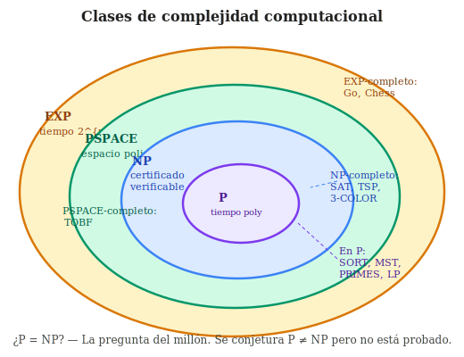

# 01 - P, NP y NP-completitud

> **Dificultad:** ⭐⭐ Intermedio · **Tiempo de lectura:** ~25 min


La complejidad computacional estudia cuántos recursos necesita un algoritmo para
resolver un problema. Su pregunta central no es solo si algo puede calcularse,
sino si puede calcularse de manera eficiente.

Entre sus conceptos más conocidos están las clases P y NP, y la noción de
NP-completitud.

## Prerrequisitos

- [Máquinas de Turing](../03-computabilidad/04-maquinas-de-turing.md)
- [Complejidad temporal de algoritmos](05-complejidad-temporal-de-algoritmos.md)

## Objetivos de aprendizaje

1. Definir las clases P y NP mediante máquinas de Turing deterministas y no deterministas.
2. Demostrar la NP-completitud de SAT con el teorema de Cook-Levin.
3. Entender el significado de la conjetura P ≠ NP y sus implicaciones.


## Problemas de decisión

Para introducir P y NP se suele trabajar con problemas de decisión: problemas
cuya respuesta es sí o no.

Ejemplos:

- ¿Existe un camino entre dos vértices de un grafo?
- ¿Tiene una fórmula booleana alguna asignación que la haga verdadera?
- ¿Existe un subconjunto de estos números que sume exactamente `K`?

Muchos problemas de optimización pueden reformularse como problemas de decisión.
Por ejemplo, en lugar de preguntar "cuál es el camino más corto", podemos
preguntar "existe un camino de longitud como máximo `K`".

## La clase P

La clase P contiene los problemas de decisión que pueden resolverse en tiempo
polinómico.

Tiempo polinómico significa que el coste está acotado por una potencia del tamaño
de la entrada:

```text
O(n), O(n^2), O(n^3), ...
```

En teoría de la complejidad, P se usa como una aproximación formal a la idea de
problema eficientemente resoluble.

## La clase NP

La clase NP contiene los problemas de decisión cuyas soluciones pueden
verificarse en tiempo polinómico.

Esto no significa necesariamente que sepamos encontrar la solución rápidamente.
Significa que, si alguien nos entrega un certificado o candidato a solución,
podemos comprobarlo de forma eficiente.

Ejemplo: para una fórmula booleana, encontrar una asignación que la haga
verdadera puede ser difícil. Pero si alguien nos da una asignación concreta,
verificar si satisface la fórmula es directo.

## P frente a NP



Todo problema en P está también en NP: si podemos resolverlo eficientemente,
también podemos verificar una solución eficientemente.

La gran pregunta es si ocurre lo contrario:

```text
P = NP ?
```

Es decir: si una solución puede verificarse rápidamente, ¿también puede
encontrarse rápidamente?

No se conoce la respuesta. La mayoría de especialistas sospecha que `P != NP`,
pero no hay demostración.

## Reducciones polinómicas

Una reducción polinómica transforma instancias de un problema `A` en instancias
de un problema `B` usando tiempo polinómico, de modo que resolver `B` permite
resolver `A`.

La intuición es:

```text
si A se reduce a B, entonces B es al menos tan difícil como A
```

Las reducciones permiten comparar problemas y construir mapas de dificultad.

## NP-completitud

Un problema es NP-completo si cumple dos condiciones:

1. Está en NP.
2. Todo problema de NP puede reducirse a él en tiempo polinómico.

Los problemas NP-completos son los problemas más difíciles dentro de NP. Si se
encontrara un algoritmo polinómico para uno de ellos, todos los problemas de NP
tendrían algoritmos polinómicos. En ese caso, `P = NP`.

## Ejemplos clásicos

Algunos problemas NP-completos importantes son:

- SAT: determinar si una fórmula booleana es satisfacible.
- 3-SAT: SAT restringido a cláusulas de tres literales.
- CLIQUE: determinar si un grafo tiene un clique de tamaño `K`.
- VERTEX-COVER: determinar si existe una cobertura de vértices de tamaño `K`.
- SUBSET-SUM: determinar si algún subconjunto suma un valor objetivo.

Estos problemas aparecen en formas distintas, pero están unidos por reducciones.

## Tractable no significa fácil en todos los casos

Decir que un problema está en P no significa que siempre sea trivial. Un algoritmo
`O(n^10)` es polinómico, pero puede ser poco práctico. Del mismo modo, algunos
algoritmos exponenciales funcionan bien en instancias pequeñas o con estructura
especial.

La complejidad ofrece un mapa de límites generales, no una sustitución del
análisis concreto de cada situación.

## Idea para recordar

P trata de resolver eficientemente. NP trata de verificar eficientemente. La
NP-completitud identifica problemas que concentran la dificultad de toda la clase
NP.

## Ideas clave

- P es la clase de problemas decidibles en tiempo polinomial determinista; NP admite verificación de certificados en tiempo polinomial.
- La pregunta P ≠ NP es el problema abierto más importante de la informática teórica.
- El teorema de Cook-Levin: SAT es NP-completo; todo problema en NP se reduce a SAT en tiempo polinomial.
- Un problema es NP-completo si está en NP y todo problema en NP se reduce a él; resolver uno en P resolvería todos.
- La distinción entre resolver (encontrar solución) y verificar (comprobar solución dada) es el núcleo de la conjetura P ≠ NP.


## Ejercicios

1. Explica la diferencia entre encontrar una solución y verificar una solución.
2. ¿Por qué todo problema en P pertenece también a NP?
3. ¿Qué implicaría encontrar un algoritmo polinómico para SAT?
4. Reformula un problema de optimización como un problema de decisión.

## Véase también

- [Reducciones polinómicas](02-reducciones-polinomicas.md)
- [SAT y 3-SAT](03-sat-y-3-sat.md)

